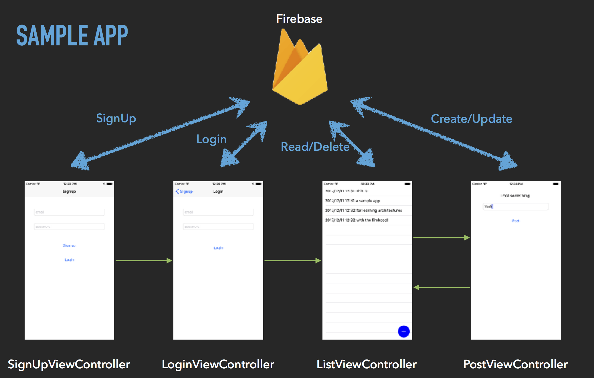

# ArchitectureSampleWithFirebase

これは、iOSアプリを色々なアーキテクチャで実装してみたものです。
(詳しくは[こちらの記事](https://medium.com/@rockname/clean-archirecture-7be37f34c943)で！)

Firebase(GoogleさんのmBaaS)でユーザーのSignUp/Login,投稿のCRUD処理をする、ものすごくシンプルなアプリです。

## アーキテクチャ一覧

- ### [MVC](https://github.com/rockname/ArchitectureSampleWithFirebase/tree/mvc)

- ### [MVP](https://github.com/rockname/ArchitectureSampleWithFirebase/tree/mvp)

- ### [MVVM](https://github.com/rockname/ArchitectureSampleWithFirebase/tree/mvvm)

- ### [Clean Architecture](https://github.com/rockname/ArchitectureSampleWithFirebase/tree/clean-architecture)

- ### [Clean Architecture + MVVM](https://github.com/rockname/ArchitectureSampleWithFirebase/tree/clean-architecture+mvvm)

## 必要事項

このアプリではCocoa PodsとFirebaseを使用しているため、まずはそれらをインストールする必要があります。

- プロジェクトのルートディレクトリで`pod install`を実行
- R.swiftというライブラリの環境を整える
  - Run Scriptに`"$PODS_ROOT/R.swift/rswift" "$SRCROOT"`と記述
  - 一度ビルドする
  - `R.generated.swift`が生成されるのでそれをプロジェクトへ追加
  
- Firebaseの環境を整える
  
  - Firebaseのプロジェクトを作成
  - `GoogleService-Info.plist`をダウンロード
  - plistをプロジェクトへ追加
  
